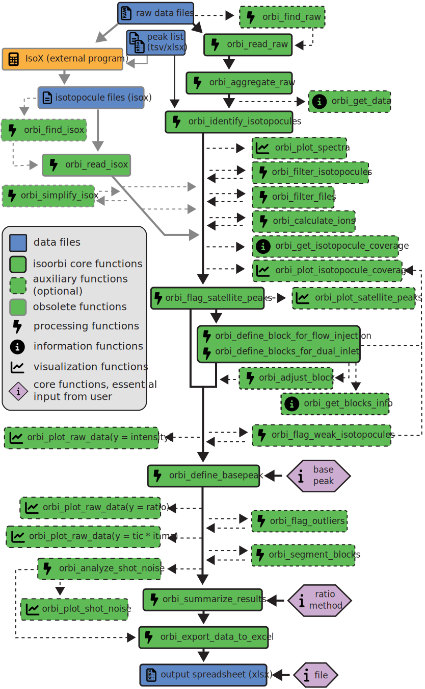

<!-- README.md is generated from README.Rmd. Please edit that file -->

# isoorbi 

<!-- badges: start -->

<!-- badges: end -->

## Overview

The goal of the isoorbi R package is to help you process isotopocule
measurements from an **Orbitrap Isotope Solutions** mass spectrometer.
It expects <code>.isox</code> files created by IsoX as input.

## Installation

You can install the current CRAN version of `isoorbi` with:

    install.packages("isoorbi")

To use the latest updates, you can install the development version of
`isoorbi` from [GitHub](https://github.com/) with:

    if(!requireNamespace("pak", quietly = TRUE)) install.packages("pak")
    pak::pak("isoverse/isoorbi")

> Important: as of isoorbi version 1.5.0, it is possible to read .raw
> files directly using the [isoraw reader](inst/assembly) built into
> this package. The first time you read a .raw file, you will be asked
> to agree to [Thermo’s license
> agreement](https://github.com/fgcz/rawrr/blob/devel/inst/rawrrassembly/RawFileReaderLicense.txt)
> to proceed. Implementation of the isoraw reader, would not have been
> possible without the example provided by Jim Shofstahl as part of
> Thermo’s
> [RawFileReader](https://github.com/thermofisherlsms/RawFileReader) and
> the raw file reader developed by Witold Wolski, Christian Panse,
> Christian Trachsel, and Tobias Kockmann as part of the [rawrr
> package](https://github.com/fgcz/rawrr).

## Show me some code

    library(isoorbi)

    system.file(package = "isoorbi", "extdata", "testfile_flow.isox") |>
      orbi_read_isox() |>
      orbi_flag_satellite_peaks() |>
      orbi_define_basepeak(basepeak_def = "M0")|> 
      orbi_summarize_results(ratio_method = "sum") |>
      orbi_export_data_to_excel(file = "data_summary.xlsx")

## Package structure

## Getting help

If you encounter a bug, please file an issue with a minimal reproducible
example on [GitHub](https://github.com/isoverse/isoorbi/issues).

For questions and other discussion, please use the [isoorbi slack
workspace](https://isoorbi.slack.com).
