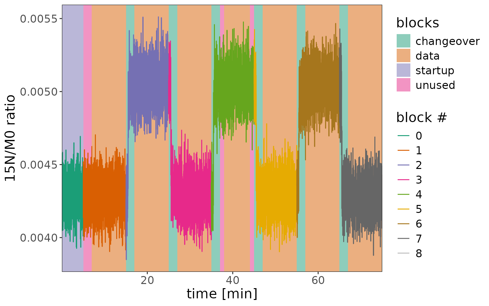

# Dual Inlet

> This is a minimal example for processing .raw data files from a dual
> inlet experiment

``` r
# libraries
library(isoorbi) #load isoorbi R package
library(forcats) #better ordering of factor variables in plots
library(dplyr) # for mutating data frames
library(ggplot2) # for data visualization
```

## Load raw file(s)

``` r
# Read test data .raw file
raw_file <- orbi_get_example_files("dual_inlet.raw")

data_all <-
  raw_file |>
  orbi_read_raw(include_spectra = c(10, 100)) |>
  orbi_aggregate_raw()
```

``` fansi
✔ [256ms] orbi_read_raw() read dual_inlet.raw from cache, included the spectra
from 2 scans
```

``` fansi
✔ [285ms] orbi_aggregate_raw() aggregated file_info (1), scans (12.34k), peaks
(51.77k), and spectra (277) from 1 file using the standard aggregator
```

``` r
# identify nitrate isotopocules
# could come from a tsv, csv, or xlsx spreadsheet instead
isotopocules <- tibble(
  compound = "nitrate",
  isotopocule = c("M0", "15N", "17O", "18O"),
  mass = c(61.9878, 62.9850, 62.9922, 63.9922)
)
data_all <- data_all |>
  orbi_identify_isotopocules(isotopocules) |>
  # disregard unidentified and missing isotopocules
  orbi_filter_isotopocules()
```

``` fansi
✔ [1.4s] orbi_identify_isotopocules() identified 49.35k/51.77k peaks (95%)
representing 100% of the total ion current (TIC) as isotopocules M0, 15N, 17O,
and 18O using the default_tolerance of 1 mmu
```

``` fansi
✔ [16ms] orbi_filter_isotopocules() removed 2.42k / 51.77k peaks (4.7%) because
they were unidentified peaks (2.42k). Remaining isotopocules: M0, 15N, 17O, and
18O.
```

## Show spectrum

``` r
data_all |> orbi_plot_spectra()
```


## Preprocess data

``` r
# Preprocess data (this is exactly the same as with an isox file)
df <- 
  data_all |>
  # check for issues
  # removes minor peaks that are in the same mass tolerance window
  # of an isotopocule 
  orbi_flag_satellite_peaks() |> 
  # flag signals of isotopocules that were not detected
  # in all scans
  orbi_flag_weak_isotopocules(min_percent = 100) |> 
  # flags outlying scans that have more than 2 times or less than
  # 1/2 times the average number of ions in the Orbitrap analyzer; 
  # another method: agc_window (see function documentation for more details)
  orbi_flag_outliers(agc_fold_cutoff = 2) |>
  # sets one isotopocule in the dataset as the base peak
  # (denominator) for ratio calculation
  orbi_define_basepeak(basepeak_def = "M0") 
```

``` fansi
✔ [880ms] orbi_flag_satellite_peaks() confirmed there are no satellite peaks
```

``` fansi
✔ [43ms] orbi_flag_weak_isotopocules() confirmed there are no weak
isotopocules: all are detected in at least 100% of scans in each of the 4 data
groups (based on uidx, compound, and isotopocule)
```

``` fansi
✔ [26ms] orbi_flag_outliers() flagged 14/12338 scans (0.11%) as outliers based
on 2 fold AGC cutoff, i.e. based on scans below 1/2 and above 2 times the
average number of ions tic * it.ms in the Orbitrap analyzer → use
orbi_plot_raw_data(y = tic * it.ms) to visualize them
```

``` fansi
✔ [1.4s] orbi_define_basepeak() set M0 as the ratio denominator and calculated
37.01k ratio values for 3 isotopocules (15N, 17O, and 18O)
```

No satellite peaks, no weak isotopocules, a few AGC fold outliers:

``` r
df |> orbi_plot_raw_data(y = tic * it.ms, y_scale = "log")
```


## Define dual inlet blocks

``` r
# define blocks
df_w_blocks <-
  df |>
  # general definition
  orbi_define_blocks_for_dual_inlet(
    # the reference block is 10 min long
    ref_block_time.min = 10, 
    # the sample block is 10 min long
    sample_block_time.min = 10, 
    # there is 5 min of data before the reference block starts, 
    # to stabilize spray conditions
    startup_time.min = 5, 
    # it takes 2 min to make sure the right solution is measured
    # after switching the valve
    change_over_time.min = 2, 
    sample_block_name = "sample",
    ref_block_name = "reference"
  ) |> 
  # fine adjustments
  # the 1st reference block is shorter by 2 min, cut from the start
  orbi_adjust_block(block = 1, shift_start_time.min = 2) |> 
  # the start and end of the 2nd reference block are manually set
  orbi_adjust_block(block = 4, set_start_time.min = 38, set_end_time.min = 44) 
```

``` fansi
Adding missing grouping variables: `uidx`
✔ [42ms] orbi_define_blocks_for_dual_inlet() identified 8 blocks (4 reference,
4 sample) in data from 1 file
✔ [7ms] orbi_adjust_block() made the following block adjustments in file
dual_inlet:
→ moved block 1 start from scan.no 823 (5.00 min) to 1153 (7.01 min)
✔ [8ms] orbi_adjust_block() made the following block adjustments in file
dual_inlet:
→ moved block 4 start from scan.no 6087 (37.00 min) to 6251 (38.00 min)
→ moved block 4 end from scan 7402 (45.00 min) to 7238 (44.00 min)
```

``` r
# get blocks info
blocks_info <- df_w_blocks |> orbi_get_blocks_info()
blocks_info |> knitr::kable()
```

| uidx | filename   | data_group | block | sample_name | data_type  | segment | start_scan.no | end_scan.no | start_time.min | end_time.min |
|-----:|:-----------|-----------:|------:|:------------|:-----------|--------:|--------------:|------------:|---------------:|-------------:|
|    1 | dual_inlet |          1 |     0 | reference   | startup    |      NA |             1 |         822 |      0.0069267 |     4.996783 |
|    1 | dual_inlet |          2 |     1 | reference   | unused     |      NA |           823 |        1152 |      5.0028499 |     7.002534 |
|    1 | dual_inlet |          3 |     1 | reference   | data       |      NA |          1153 |        2467 |      7.0086023 |    14.994198 |
|    1 | dual_inlet |          4 |     2 | sample      | changeover |      NA |          2468 |        2796 |     15.0002893 |    16.996492 |
|    1 | dual_inlet |          5 |     2 | sample      | data       |      NA |          2797 |        4112 |     17.0025578 |    24.994222 |
|    1 | dual_inlet |          6 |     3 | reference   | changeover |      NA |          4113 |        4441 |     25.0005399 |    26.997343 |
|    1 | dual_inlet |          7 |     3 | reference   | data       |      NA |          4442 |        5757 |     27.0034184 |    34.995687 |
|    1 | dual_inlet |          8 |     4 | sample      | changeover |      NA |          5758 |        6086 |     35.0019892 |    36.998449 |
|    1 | dual_inlet |          9 |     4 | sample      | unused     |      NA |          6087 |        6250 |     37.0045150 |    37.994845 |
|    1 | dual_inlet |         10 |     4 | sample      | data       |      NA |          6251 |        7238 |     38.0009123 |    43.999949 |
|    1 | dual_inlet |         11 |     4 | sample      | unused     |      NA |          7239 |        7402 |     44.0060263 |    44.996372 |
|    1 | dual_inlet |         12 |     5 | reference   | changeover |      NA |          7403 |        7730 |     45.0026717 |    46.994070 |
|    1 | dual_inlet |         13 |     5 | reference   | data       |      NA |          7731 |        9047 |     47.0001525 |    54.996822 |
|    1 | dual_inlet |         14 |     6 | sample      | changeover |      NA |          9048 |        9376 |     55.0031201 |    56.999885 |
|    1 | dual_inlet |         15 |     6 | sample      | data       |      NA |          9377 |       10692 |     57.0059518 |    64.997181 |
|    1 | dual_inlet |         16 |     7 | reference   | changeover |      NA |         10693 |       11020 |     65.0035025 |    66.994101 |
|    1 | dual_inlet |         17 |     7 | reference   | data       |      NA |         11021 |       12337 |     67.0001943 |    74.997220 |
|    1 | dual_inlet |         18 |     8 | sample      | changeover |      NA |         12338 |       12338 |     75.0035170 |    75.003517 |

## Raw data plots

### Plot 1: default block highlights + outliers

``` r
# total ions per scan
df_w_blocks |> orbi_plot_raw_data(y = intensity, y_scale = "linear")
```


``` r
# isotopocule ratios - you can see that even the AGC outliers
# still create decent ratios
df_w_blocks |>  orbi_plot_raw_data(y = ratio)
```


### Plot 2: highlight blocks in data + no outliers

``` r
df_w_blocks |> 
  orbi_plot_raw_data(
    isotopocules = "15N",
    y = ratio,
    color = NULL,
    add_all_blocks = TRUE,
    show_outliers = FALSE
  ) +
  # add other ggplot elements, e.g. more specific axis labels
  labs(x = "time [min]", y = "15N/M0 ratio")
```


### Plot 3: highlight sample blocks on top

``` r
df_w_blocks |> 
  orbi_plot_raw_data(
    isotopocules = "15N",
    y = ratio,
    add_all_blocks = TRUE,
    show_outliers = FALSE,
    color = factor(block)
  ) +
  labs(x = "time [min]", y = "15N/M0 ratio", color = "block #")
```



## Data summaries

``` r
# calculate summary
df_w_summary <- 
  df_w_blocks |>
  # segment (optional)
  orbi_segment_blocks(into_segments = 3) |>
  # calculate results, including for the unused parts of the data blocks
  orbi_summarize_results(
    ratio_method = "sum",
    include_unused_data = TRUE
  )
```

``` fansi
✔ [37ms] orbi_segment_blocks() segmented 8 data blocks in 1 file creating 3
segments per block (on average) with 420 scans per segment (on average)
```

``` fansi
✔ [714ms] orbi_summarize_results() summarized ratios from 36.97k peak
(excluding 42 flagged peaks; including 10.35k unused peaks) using the sum
method and grouping the data by uidx, filename, compound, basepeak,
isotopocule, block, sample_name, segment, data_group, and data_type
```

``` r
# export file info and summary to excel
df_w_summary |> orbi_export_data_to_excel(
  file = "output.xlsx",
  include = c("file_info", "summary")
)
```

``` fansi
✔ [419ms] orbi_export_data_to_excel() exported the dataset (1 row of file_info
and 96 rows of summary) to output.xlsx
```

### Plot 1: ratios summary by block and segment

``` r
# get out the summary and plot all isotopocules using a ggplot from scratch
df_w_summary |>
  orbi_get_data(summary = everything()) |>
  filter(data_type == "data") |>
  mutate(block_seg = sprintf("%s.%s", block, segment) |> fct_inorder()) |>
  # data
  ggplot() +
  aes(
    x = block_seg,
    y = ratio, ymin = ratio - ratio_sem, ymax = ratio + ratio_sem,
    color = sample_name
  ) +
  geom_pointrange() +
  facet_grid(isotopocule ~ ., scales = "free_y") +
  # scales
  scale_color_brewer(palette = "Set1") +
  theme_bw() +
  labs(x = "block.segment", y = "ratio")
```

``` fansi
✔ [10ms] orbi_get_data() retrieved 96 records from the combination of file_info
(1) and summary (96) via uidx
```


### Plot 2: ratios with block backgrounds and raw data

``` r
# make a plot for 15N
plot2 <- df_w_blocks |>
  orbi_get_data(scans = everything(), peaks = everything()) |>
  filter(isotopocule == "15N") |>
  mutate(panel = "raw ratios") |>
  # raw data plot
  orbi_plot_raw_data(
    y = ratio,
    color = NULL,
    add_all_blocks = TRUE,
    show_outliers = FALSE
  ) +
   # ratio summary data
  geom_pointrange(
    data = function(df) {
      df_w_summary |> 
        orbi_get_data(summary = everything()) |>
        filter(as.character(isotopocule) == df$isotopocule[1]) |> 
        mutate(panel = "summary")
    },
    map = aes(
      x = mean_time.min, y = ratio, 
      ymin = ratio - ratio_sem, ymax = ratio + ratio_sem,
      shape = sample_name
    ), 
    size = 0.5
  ) +
  facet_grid(panel ~ ., switch = "y") +
  theme(strip.placement = "outside") +
  labs(y = NULL, title = "15N/M0")
```

``` fansi
✔ [17ms] orbi_get_data() retrieved 37.01k records from the combination of
file_info (1), scans (12.34k), and peaks (37.01k) via uidx and scan.no
```

``` r
plot2
```

``` fansi
✔ [9ms] orbi_get_data() retrieved 96 records from the combination of file_info
(1) and summary (96) via uidx
```


``` r
# same but with 18O
plot2 %+% 
  (df_w_blocks |> orbi_get_data(scans = everything(), peaks = everything()) |>
   filter(isotopocule == "18O") |> mutate(panel = "raw ratios")) +
  labs(title = "18O/M0")
```

``` fansi
✔ [17ms] orbi_get_data() retrieved 37.01k records from the combination of
file_info (1), scans (12.34k), and peaks (37.01k) via uidx and scan.no
```

``` fansi
✔ [9ms] orbi_get_data() retrieved 96 records from the combination of file_info
(1) and summary (96) via uidx
```


