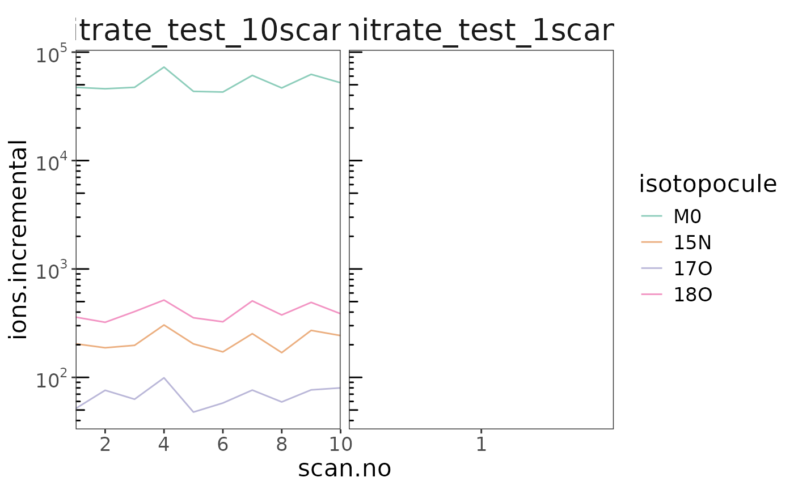
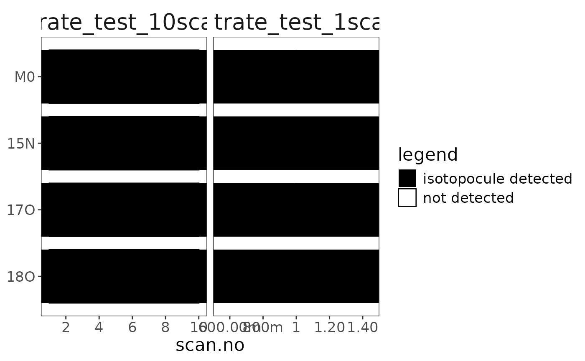

# Functionality Guide

> This step-by-step functionality guide is still in development.
> Eventually all functions in the [package structure
> flowchart](https://isoorbi.isoverse.org/index.html#package-structure)
> will be covered with detailed examples. All functions below labelled
> with an `*` are required steps of the standard data processing flow.
> Everything else is optional. Rarely used additional features that are
> mentioned here but not part of the standard flowchart are labeled as
> `bonus`.

``` r
# libraries
library(isoorbi) #load isoorbi R package
library(dplyr) # for mutating data frames
```

## Reading raw files

First step is reading in your .raw data files.

### `orbi_find_raw()`

``` r
# path to your data folder
data_folder <- file.path("data")

# finding raw files with "nitrate" in the name in the data folder
file_paths <- data_folder |> orbi_find_raw(pattern = "nitrate")

# show what was found
file_paths
```

    [1] "data/nitrate_test_10scans.raw.cache.zip"
    [2] "data/nitrate_test_1scan.raw.cache.zip"  

### `orbi_read_raw()` \*

``` r
# read files (simplest)
raw_files <- file_paths |> orbi_read_raw()
```

``` fansi
✔ [237ms] orbi_read_raw() read nitrate_test_10scans.raw from cache
```

``` fansi
✔ [50ms] orbi_read_raw() read nitrate_test_1scan.raw from cache
```

``` fansi
✔ [382ms] orbi_read_raw() finished reading 2 files
```

``` r
# read files including some raw spectra
raw_files <-
  file_paths |>
  # load the spectra from scans 1, 10, and 100
  orbi_read_raw(include_spectra = c(1, 10, 100)) |>
  # you can quiet any call with suppressMessages
  # that way it won't print the info message
  suppressMessages()

# show summary for the files that were read
raw_files
```

``` fansi
──────────────── 2 raw files - combine with orbi_aggregate_raw() ───────────────
```

``` fansi
1. nitrate_test_10scans.raw has 10 scans with 126 peaks; + loaded 2 spectra
(618 points)
2. nitrate_test_1scan.raw   has  1 scans with  12 peaks; + loaded 1 spectrum
(325 points)
```

### `orbi_aggregate_data()` \*

Combine (aggregate) the data from the raw files.

``` r
# aggregate raw data
agg_data <- raw_files |> orbi_aggregate_raw()
```

``` fansi
✔ [559ms] orbi_aggregate_raw() aggregated file_info (2), scans (11), peaks
(138), and spectra (943) from 2 files using the standard aggregator
```

``` r
# shaw all that was recovered
# (as well as what was ignored/not aggregated)
agg_data
```

``` fansi
─────── aggregated data from 2 raw files - retrieve with orbi_get_data() ───────
```

``` fansi
→ file_info (2): uidx, filepath, filename, creation_date, in_aquisition,
Operator, FileDescription, MassResolution, SpectraCount, FirstSpectrum,
LastSpectrum, StartTime, EndTime, LowMass, HighMass, InstrumentCount,
InstrumentModel, InstrumentName, SerialNumber, SoftwareVersion,
HardwareVersion, RawFileVersion, InstrumentUnits, Comment, SampleId,
SampleName, SampleType, SampleWeight, SampleVolume, Barcode, RowNumber, Vial,
InjectionVolume, DilutionFactor, IstdAmount, CalibrationLevel,
InstrumentMethodFile, CalibrationFile, ProcessingMethodFile, UserText0,
UserText1, UserText2, UserText3, UserText4
```

``` fansi
→ scans (11): uidx, scan.no, time.min, tic, it.ms, resolution, microscans,
basePeakMz, basePeakIntensity, lowMass, highMass, rawOvFtT, intensCompFactor,
agc, agcTarget, numberLockmassesFound, analyzerTemperature; (not aggregated:
IsCentroidScan, ScanType, Scan Description, Multiple Injection, Multi Inject
Info, Scan Segment, Scan Event, Master Index, Master Scan Number, Charge State,
Monoisotopic M/Z, Error in isotopic envelope fit, Max. Ion Time (ms), MS2
Isolation Width, MS2 Isolation Offset, HCD Energy, HCD Energy V, === Mass
Calibration: ===, Conversion Parameter B, Conversion Parameter C, Temperature
Comp. (ppm), RF Comp. (ppm), Space Charge Comp. (ppm), Resolution Comp. (ppm),
Number of Lock Masses, Lock Mass #1 (m/z), Lock Mass #2 (m/z), Lock Mass #3
(m/z), LM Search Window (ppm), LM Search Window (mmu), Last Locking (sec), LM
m/z-Correction (ppm), === Ion Optics Settings: ===, S-Lens RF Level, ====
Diagnostic Data: ====, Application Mode, Mild Trapping Mode, APD, Res. Dep.
Intens, Q Trans Comp, PrOSA NumF, PrOSA Comp, PrOSA ScScr, Dynamic RT Shift
(min), Analytical OT usage (%), LC FWHM parameter, PS Inj. Time (ms), AGC PS
Mode, AGC PS Diag, AGC Target Adjust, AGC Diag 1, AGC Diag 2, HCD abs. Offset,
Source CID eV, AGC Fill, Injection t0, t0 FLP, Iso Para R, Inj Para R, Access
Id, Analog In A (V), Analog In B (V), FAIMS Attached, FAIMS Voltage On, FAIMS
CV)
```

``` fansi
→ peaks (138): uidx, scan.no, mzMeasured, intensity, baseline, peakNoise,
peakResolution, isRefPeak, isLockPeak
```

``` fansi
→ spectra (943): uidx, scan.no, mz, intensity
```

``` fansi
→ problems: has no issues
```

#### bonus `orbi_get_aggregator()`

You can optionally use a different aggregator. The `minimal` aggregator
contains a smaller set of columns to aggregate. The `extended`
aggregator is more elaborate, providing access to additional columns
from the raw data files.

``` r
# example: minimal vs. extended aggregator
orbi_get_aggregator("minimal")
```

``` fansi
────────────────────────────── Aggregator minimal ──────────────────────────────
```

``` fansi
Dataset file_info:
 → filename = as.character(sub(FileName, pattern = ".raw", replacement = "",
fixed = TRUE))
 → creation_date = as.POSIXct(CreationDate)
 → in_aquisition = as.logical(InAquisition)
Dataset scans:
 → scan.no = as.integer(scan.no)
 → time.min = as.numeric(StartTime)
 → tic = as.numeric(TIC)
 → it.ms = as.numeric(`Ion Injection Time (ms)`)
 → resolution = as.numeric(one_of(`FT Resolution`, `Orbitrap Resolution`))
 → microscans = as.integer(`Micro Scan Count`)
Dataset peaks:
 → scan.no = as.integer(scan.no)
 → mzMeasured = as.numeric(mass)
 → intensity = as.numeric(intensity)
 → baseline = as.numeric(baseline)
 → peakNoise = as.numeric(noise)
 → peakResolution = as.numeric(resolution)
 → isRefPeak = as.logical(is_ref)
 → isLockPeak = as.logical(is_lock_peak)
Dataset spectra:
 → scan.no = as.integer(scan.no)
 → mz = as.numeric(mass)
 → intensity = as.numeric(intensity)
```

``` r
orbi_get_aggregator("extended")
```

``` fansi
────────────────────────────── Aggregator extended ─────────────────────────────
```

``` fansi
Dataset file_info:
 → filename = as.character(sub(FileName, pattern = ".raw", replacement = "",
fixed = TRUE))
 → creation_date = as.POSIXct(CreationDate)
 → in_aquisition = as.logical(InAquisition)
 → (.*) = as.character(all_matches("(.*)"))
Dataset scans:
 → scan.no = as.integer(scan.no)
 → time.min = as.numeric(StartTime)
 → tic = as.numeric(TIC)
 → it.ms = as.numeric(`Ion Injection Time (ms)`)
 → resolution = as.numeric(one_of(`FT Resolution`, `Orbitrap Resolution`))
 → microscans = as.integer(`Micro Scan Count`)
 → basePeakMz = as.numeric(BasePeakMass)
 → basePeakIntensity = as.numeric(BasePeakIntensity)
 → lowMass = as.numeric(LowMass)
 → highMass = as.numeric(HighMass)
 → rawOvFtT = as.numeric(RawOvFtT)
 → intensCompFactor = as.numeric(`OT Intens Comp Factor`)
 → agc = as.character(AGC)
 → agcTarget = as.integer(`AGC Target`)
 → numberLockmassesFound = as.integer(`Number of LM Found`)
 → analyzerTemperature = as.numeric(`Analyzer Temperature`)
 → (.*) = as.character(all_matches("(.*)"))
Dataset peaks:
 → scan.no = as.integer(scan.no)
 → mzMeasured = as.numeric(mass)
 → intensity = as.numeric(intensity)
 → baseline = as.numeric(baseline)
 → peakNoise = as.numeric(noise)
 → peakResolution = as.numeric(resolution)
 → isRefPeak = as.logical(is_ref)
 → isLockPeak = as.logical(is_lock_peak)
Dataset spectra:
 → scan.no = as.integer(scan.no)
 → mz = as.numeric(mass)
 → intensity = as.numeric(intensity)
```

``` r
# using the extended aggregator instead of the default (standard)
raw_files |> orbi_aggregate_raw(aggregator = "extended")
```

``` fansi
✔ [930ms] orbi_aggregate_raw() aggregated file_info (2), scans (11), peaks
(138), and spectra (943) from 2 files using the extended aggregator
```

``` fansi
─────── aggregated data from 2 raw files - retrieve with orbi_get_data() ───────
```

``` fansi
→ file_info (2): uidx, filepath, filename, creation_date, in_aquisition,
Operator, FileDescription, MassResolution, SpectraCount, FirstSpectrum,
LastSpectrum, StartTime, EndTime, LowMass, HighMass, InstrumentCount,
InstrumentModel, InstrumentName, SerialNumber, SoftwareVersion,
HardwareVersion, RawFileVersion, InstrumentUnits, Comment, SampleId,
SampleName, SampleType, SampleWeight, SampleVolume, Barcode, RowNumber, Vial,
InjectionVolume, DilutionFactor, IstdAmount, CalibrationLevel,
InstrumentMethodFile, CalibrationFile, ProcessingMethodFile, UserText0,
UserText1, UserText2, UserText3, UserText4
```

``` fansi
→ scans (11): uidx, scan.no, time.min, tic, it.ms, resolution, microscans,
basePeakMz, basePeakIntensity, lowMass, highMass, rawOvFtT, intensCompFactor,
agc, agcTarget, numberLockmassesFound, analyzerTemperature, IsCentroidScan,
ScanType, Scan Description, Multiple Injection, Multi Inject Info, Scan
Segment, Scan Event, Master Index, Master Scan Number, Charge State,
Monoisotopic M/Z, Error in isotopic envelope fit, Max. Ion Time (ms), MS2
Isolation Width, MS2 Isolation Offset, HCD Energy, HCD Energy V, === Mass
Calibration: ===, Conversion Parameter B, Conversion Parameter C, Temperature
Comp. (ppm), RF Comp. (ppm), Space Charge Comp. (ppm), Resolution Comp. (ppm),
Number of Lock Masses, Lock Mass #1 (m/z), Lock Mass #2 (m/z), Lock Mass #3
(m/z), LM Search Window (ppm), LM Search Window (mmu), Last Locking (sec), LM
m/z-Correction (ppm), === Ion Optics Settings: ===, S-Lens RF Level, ====
Diagnostic Data: ====, Application Mode, Mild Trapping Mode, APD, Res. Dep.
Intens, Q Trans Comp, PrOSA NumF, PrOSA Comp, PrOSA ScScr, Dynamic RT Shift
(min), Analytical OT usage (%), LC FWHM parameter, PS Inj. Time (ms), AGC PS
Mode, AGC PS Diag, AGC Target Adjust, AGC Diag 1, AGC Diag 2, HCD abs. Offset,
Source CID eV, AGC Fill, Injection t0, t0 FLP, Iso Para R, Inj Para R, Access
Id, Analog In A (V), Analog In B (V), FAIMS Attached, FAIMS Voltage On, FAIMS
CV
```

``` fansi
→ peaks (138): uidx, scan.no, mzMeasured, intensity, baseline, peakNoise,
peakResolution, isRefPeak, isLockPeak
```

``` fansi
→ spectra (943): uidx, scan.no, mz, intensity
```

``` fansi
→ problems: has no issues
```

#### bonus `orbi_register_aggregator()`

Or even build your own aggregator with
[`orbi_start_aggregator()`](https://isoorbi.isoverse.org/reference/orbi_aggregator.md)
and/or expand an existing one with `orgi_add_to_aggregator()` and then
register it via
[`orbi_register_aggregator()`](https://isoorbi.isoverse.org/reference/orbi_aggregator.md).
This funnctionality is rarely needed and thus not part of the package
structure flowchart.

``` r
my_agg <- 
  orbi_get_aggregator("minimal") |>
  # pull out the S-Lens RF Level information from the scans and store it as a number
  orbi_add_to_aggregator("scans", "slens_rf", source = "S-Lens RF Level", cast = "as.numeric") |>
  orbi_register_aggregator(name = "test")

# show my agg summary
my_agg
```

``` fansi
────────────────────────────── Aggregator minimal ──────────────────────────────
```

``` fansi
Dataset file_info:
 → filename = as.character(sub(FileName, pattern = ".raw", replacement = "",
fixed = TRUE))
 → creation_date = as.POSIXct(CreationDate)
 → in_aquisition = as.logical(InAquisition)
Dataset scans:
 → scan.no = as.integer(scan.no)
 → time.min = as.numeric(StartTime)
 → tic = as.numeric(TIC)
 → it.ms = as.numeric(`Ion Injection Time (ms)`)
 → resolution = as.numeric(one_of(`FT Resolution`, `Orbitrap Resolution`))
 → microscans = as.integer(`Micro Scan Count`)
 → slens_rf = as.numeric(`S-Lens RF Level`)
Dataset peaks:
 → scan.no = as.integer(scan.no)
 → mzMeasured = as.numeric(mass)
 → intensity = as.numeric(intensity)
 → baseline = as.numeric(baseline)
 → peakNoise = as.numeric(noise)
 → peakResolution = as.numeric(resolution)
 → isRefPeak = as.logical(is_ref)
 → isLockPeak = as.logical(is_lock_peak)
Dataset spectra:
 → scan.no = as.integer(scan.no)
 → mz = as.numeric(mass)
 → intensity = as.numeric(intensity)
```

``` r
# use it
raw_files |> orbi_aggregate_raw(aggregator = "test")
```

``` fansi
✔ [247ms] orbi_aggregate_raw() aggregated file_info (2), scans (11), peaks
(138), and spectra (943) from 2 files using the test aggregator
```

``` fansi
─────── aggregated data from 2 raw files - retrieve with orbi_get_data() ───────
```

``` fansi
→ file_info (2): uidx, filepath, filename, creation_date, in_aquisition; (not
aggregated: Operator, FileDescription, MassResolution, SpectraCount,
FirstSpectrum, LastSpectrum, StartTime, EndTime, LowMass, HighMass,
InstrumentCount, InstrumentModel, InstrumentName, SerialNumber,
SoftwareVersion, HardwareVersion, RawFileVersion, InstrumentUnits, Comment,
SampleId, SampleName, SampleType, SampleWeight, SampleVolume, Barcode,
RowNumber, Vial, InjectionVolume, DilutionFactor, IstdAmount, CalibrationLevel,
InstrumentMethodFile, CalibrationFile, ProcessingMethodFile, UserText0,
UserText1, UserText2, UserText3, UserText4)
```

``` fansi
→ scans (11): uidx, scan.no, time.min, tic, it.ms, resolution, microscans,
slens_rf; (not aggregated: BasePeakIntensity, BasePeakMass, HighMass,
IsCentroidScan, LowMass, ScanType, Scan Description, Multiple Injection, Multi
Inject Info, AGC, Scan Segment, Scan Event, Master Index, Master Scan Number,
Charge State, Monoisotopic M/Z, Error in isotopic envelope fit, Max. Ion Time
(ms), MS2 Isolation Width, MS2 Isolation Offset, AGC Target, HCD Energy, HCD
Energy V, Analyzer Temperature, === Mass Calibration: ===, Conversion Parameter
B, Conversion Parameter C, Temperature Comp. (ppm), RF Comp. (ppm), Space
Charge Comp. (ppm), Resolution Comp. (ppm), Number of Lock Masses, Lock Mass #1
(m/z), Lock Mass #2 (m/z), Lock Mass #3 (m/z), LM Search Window (ppm), LM
Search Window (mmu), Number of LM Found, Last Locking (sec), LM m/z-Correction
(ppm), === Ion Optics Settings: ===, ==== Diagnostic Data: ====, Application
Mode, Mild Trapping Mode, APD, OT Intens Comp Factor, Res. Dep. Intens, Q Trans
Comp, PrOSA NumF, PrOSA Comp, PrOSA ScScr, RawOvFtT, Dynamic RT Shift (min),
Analytical OT usage (%), LC FWHM parameter, PS Inj. Time (ms), AGC PS Mode, AGC
PS Diag, AGC Target Adjust, AGC Diag 1, AGC Diag 2, HCD abs. Offset, Source CID
eV, AGC Fill, Injection t0, t0 FLP, Iso Para R, Inj Para R, Access Id, Analog
In A (V), Analog In B (V), FAIMS Attached, FAIMS Voltage On, FAIMS CV)
```

``` fansi
→ peaks (138): uidx, scan.no, mzMeasured, intensity, baseline, peakNoise,
peakResolution, isRefPeak, isLockPeak
```

``` fansi
→ spectra (943): uidx, scan.no, mz, intensity
```

``` fansi
→ problems: has no issues
```

#### bonus `orbi_get_problems()`

There were no problems reading and/or aggregating the raw data so these
are empty but this can be very helpful to see what went wrong during
reading or aggregation.

``` r
raw_files |> orbi_get_problems()
```

``` fansi
# A tibble: 0 × 6
# ℹ 6 variables: uidx <int>, file <chr>, type <chr>, call <chr>, message <chr>,
#   condition <list>
```

``` r
agg_data |> orbi_get_problems()
```

``` fansi
# A tibble: 0 × 6
# ℹ 6 variables: uidx <int>, file <chr>, type <chr>, call <chr>, message <chr>,
#   condition <list>
```

### `orbi_get_data()`

At this point (and any later point), you can always extract the data of
interest from the aggregated data set using
[`orbi_get_data()`](https://isoorbi.isoverse.org/reference/orbi_get_data.md).
If you prefer working with a data frame tibble from
[`orbi_get_data()`](https://isoorbi.isoverse.org/reference/orbi_get_data.md)
instead of the aggregated data structure, you can switch to that at any
point and use the resulting data frame tibble in subsequent functions.

``` r
# direct access to the data stored in the aggregated dataset
agg_data$file_info
```

``` fansi
# A tibble: 2 × 44
   uidx filepath             filename creation_date       in_aquisition Operator
  <int> <chr>                <chr>    <dttm>              <lgl>         <chr>   
1     1 data/nitrate_test_1… nitrate… 2025-01-30 13:57:12 FALSE         SYSTEM  
2     2 data/nitrate_test_1… nitrate… 2025-01-30 14:01:04 FALSE         SYSTEM  
# ℹ 38 more variables: FileDescription <chr>, MassResolution <chr>,
#   SpectraCount <chr>, FirstSpectrum <chr>, LastSpectrum <chr>,
#   StartTime <chr>, EndTime <chr>, LowMass <chr>, HighMass <chr>,
#   InstrumentCount <chr>, InstrumentModel <chr>, InstrumentName <chr>,
#   SerialNumber <chr>, SoftwareVersion <chr>, HardwareVersion <chr>,
#   RawFileVersion <chr>, InstrumentUnits <chr>, Comment <chr>, SampleId <chr>,
#   SampleName <chr>, SampleType <chr>, SampleWeight <chr>, …
```

``` r
agg_data$scans
```

``` fansi
# A tibble: 11 × 17
    uidx scan.no time.min      tic it.ms resolution microscans basePeakMz
   <int>   <int>    <dbl>    <dbl> <dbl>      <dbl>      <int>      <dbl>
 1     1       1  0.00454 4336653   68.3      60000          1       62.0
 2     1       2  0.00675 3391426.  80.6      60000          1       62.0
 3     1       3  0.00897 3665948.  79.5      60000          1       62.0
 4     1       4  0.0112  5965333  100.       60000          1       62.0
 5     1       5  0.0134  2595905.  94.3      60000          1       62.0
 6     1       6  0.0156  4273768.  55.3      60000          1       62.0
 7     1       7  0.0181  3134818. 131.       60000          1       62.0
 8     1       8  0.0203  3522451.  78.7      60000          1       62.0
 9     1       9  0.0225  4324210. 109.       60000          1       62.0
10     1      10  0.0247  3553078.  95.7      60000          1       62.0
11     2       1  0.00399 6382695   56.6      60000          1       62.0
# ℹ 9 more variables: basePeakIntensity <dbl>, lowMass <dbl>, highMass <dbl>,
#   rawOvFtT <dbl>, intensCompFactor <dbl>, agc <chr>, agcTarget <int>,
#   numberLockmassesFound <int>, analyzerTemperature <dbl>
```

``` r
agg_data$peaks
```

``` fansi
# A tibble: 138 × 9
    uidx scan.no mzMeasured intensity baseline peakNoise peakResolution
   <int>   <int>      <dbl>     <dbl>    <dbl>     <dbl>          <dbl>
 1     1       1       62.0     1211.     8.32      513.          70900
 2     1       1       62.0     1463.     8.32      513.          94100
 3     1       1       62.0     1172.     8.31      513.          80300
 4     1       1       62.0     1116.     8.30      513.          87900
 5     1       1       62.0  4046979      8.28      513.         114902
 6     1       1       62.0     1798.     8.26      513.          86300
 7     1       1       62.0     1444.     8.26      513.          93200
 8     1       1       62.0     1346.     8.25      513.          84700
 9     1       1       62.0     1469.     8.25      513.          92400
10     1       1       62.1     1043.     8.16      513.          89900
# ℹ 128 more rows
# ℹ 2 more variables: isRefPeak <lgl>, isLockPeak <lgl>
```

``` r
agg_data$spectra
```

``` fansi
# A tibble: 943 × 4
    uidx scan.no    mz intensity
   <int>   <int> <dbl>     <dbl>
 1     1       1  60.9        0 
 2     1       1  60.9        0 
 3     1       1  60.9        0 
 4     1       1  60.9        0 
 5     1       1  62.0        0 
 6     1       1  62.0        0 
 7     1       1  62.0        0 
 8     1       1  62.0        0 
 9     1       1  62.0      496.
10     1       1  62.0      935.
# ℹ 933 more rows
```

``` r
# better way to retrieve+combine the data with dplyr select syntax:
agg_data |>
  orbi_get_data(
    file_info = c("filename", "creation_date", "instrument" = "InstrumentModel"),
    scans = c("time.min", "tic", "resolution"),
    peaks = c("mz" = "mzMeasured", starts_with("peak"))
  )
```

``` fansi
✔ [15ms] orbi_get_data() retrieved 138 records from the combination of
file_info (2), scans (11), and peaks (138) via uidx and scan.no
```

``` fansi
# A tibble: 138 × 11
    uidx filename         creation_date       instrument scan.no time.min    tic
   <int> <chr>            <dttm>              <chr>        <int>    <dbl>  <dbl>
 1     1 nitrate_test_10… 2025-01-30 13:57:12 Orbitrap …       1  0.00454 4.34e6
 2     1 nitrate_test_10… 2025-01-30 13:57:12 Orbitrap …       1  0.00454 4.34e6
 3     1 nitrate_test_10… 2025-01-30 13:57:12 Orbitrap …       1  0.00454 4.34e6
 4     1 nitrate_test_10… 2025-01-30 13:57:12 Orbitrap …       1  0.00454 4.34e6
 5     1 nitrate_test_10… 2025-01-30 13:57:12 Orbitrap …       1  0.00454 4.34e6
 6     1 nitrate_test_10… 2025-01-30 13:57:12 Orbitrap …       1  0.00454 4.34e6
 7     1 nitrate_test_10… 2025-01-30 13:57:12 Orbitrap …       1  0.00454 4.34e6
 8     1 nitrate_test_10… 2025-01-30 13:57:12 Orbitrap …       1  0.00454 4.34e6
 9     1 nitrate_test_10… 2025-01-30 13:57:12 Orbitrap …       1  0.00454 4.34e6
10     1 nitrate_test_10… 2025-01-30 13:57:12 Orbitrap …       1  0.00454 4.34e6
# ℹ 128 more rows
# ℹ 4 more variables: resolution <dbl>, mz <dbl>, peakNoise <dbl>,
#   peakResolution <dbl>
```

## Identifying isotopocules

The next step is identifying isotpocules.

### `orbi_identify_isotopocules()` \*

``` r
# list of isotopocules (can alternatively be in a tsv/csv/xlsx file)
isotopocules <- tibble(
    compound = "nitrate",
    isotopolog = c("M0", "15N", "17O", "18O"),
    mass = c(61.9878, 62.9850, 62.9922, 63.9922),
    tolerance = 1,
    charge = 1
  )

# identify
data <- agg_data |> orbi_identify_isotopocules(isotopocules)
```

``` fansi
✔ [45ms] orbi_identify_isotopocules() identified 44/138 peaks (32%)
representing 100% of the total ion current (TIC) as isotopocules M0, 15N, 17O,
and 18O
```

### `orbi_plot_spectra()`

## Data checks

### `orbi_flag_satellite_peas()` \*

``` r
# this can happen here or later on in the workflow
# in the case of these files there are no satellite peaks
data |> orbi_flag_satellite_peaks() |> orbi_plot_satellite_peaks()
```

``` fansi
✔ [10ms] orbi_flag_satellite_peaks() confirmed there are no satellite peaks
```

``` fansi
`geom_line()`: Each group consists of only one observation.
ℹ Do you need to adjust the group aesthetic?
```



### `orbi_plot_isotopocule_coverage()`

``` r
# this can happen here or later on in the workflow
data |> orbi_get_isotopocule_coverage()
```

``` fansi
# A tibble: 8 × 10
   uidx filename        compound isotopocule data_stretch n_points start_scan.no
  <int> <fct>           <fct>    <fct>              <int>    <int>         <int>
1     1 nitrate_test_1… nitrate  M0                     0       10             1
2     1 nitrate_test_1… nitrate  15N                    0       10             1
3     1 nitrate_test_1… nitrate  17O                    0       10             1
4     1 nitrate_test_1… nitrate  18O                    0       10             1
5     2 nitrate_test_1… nitrate  M0                     0        1             1
6     2 nitrate_test_1… nitrate  15N                    0        1             1
7     2 nitrate_test_1… nitrate  17O                    0        1             1
8     2 nitrate_test_1… nitrate  18O                    0        1             1
# ℹ 3 more variables: end_scan.no <int>, start_time.min <dbl>,
#   end_time.min <dbl>
```

``` r
data |> orbi_plot_isotopocule_coverage()
```



## Ratio calculations

### `orbi_define_basepeak()` \*

### `orbi_summarize_results()` \*
